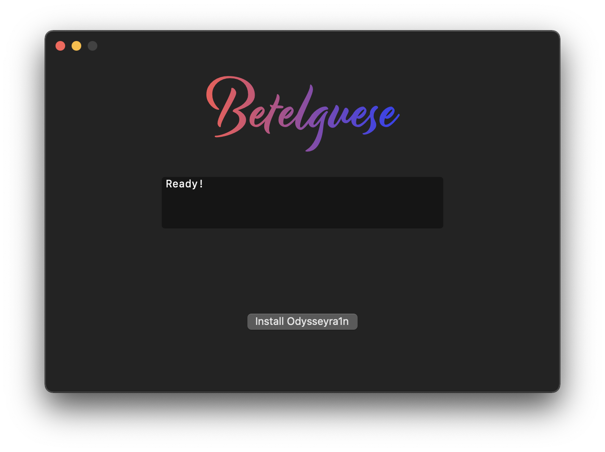

     

    <strong>A GUI for the Odysseyra1n bootstrap installation.</strong> 

    <a href="#overview">Overview</a> •
    <a href="https://discord.gg/Udn4kQg">Support Server</a> •
    <a href="https://choosealicense.com/licenses/gpl-3.0/">License</a> •
    <a href="#credits">Credits</a>

    

## Overview

**To install**, simply run `brew install betelguese` if you use [brew](https://docs.brew.sh/Installation) or download the [latest release](https://github.com/23Aaron/Betelguese/releases), and just open! 
**Before running the GUI, make sure you jailbreak with checkra1n beforehand.** 
**After you run the GUI, make sure to install Rocketbootstrap and Preferenceloader before anything else.** 
libhooker installation and activation is automatically handled. 
Compatibility is with every device that checkra1n is compatible with as this is a bootstrap installed over checkra1n's. 

Because of Procursus, you are now able to have support for **all four main package managers natively (for the first time)**. 
Sileo (**Preinstalled**), Cydia (*on the Procursus Repo, forked by Kronos*), Zebra (available on Procursus), and Installer. 

It's further to note that Procursus is also maintained **by the community** with its build system by [@Diatrus](https://twitter.com/Diatrus) & [@hbkirb](https://twitter.com/hbkirb). 
Documentation for further contribution is available here: [Procursus](https://github.com/ProcursusTeam/Procursus)

## Credits

Odyssey Repo Maintained by: [@CStar_OW](https://twitter.com/CStar_OW) 
Procursus Repo Maintained by: [@Diatrus](https://twitter.com/Diatrus) & the Community 
README Dev: [revisitable](https://github.com/revisitable)
###### Made by [23Aaron](https://github.com/23Aaron) & [Kirb](https://github.com/kirb)