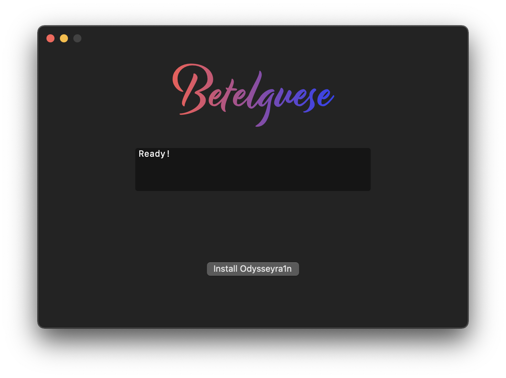

  
   
  <h3 align="center">by @23Aaron_ & @hbkirb</h3>

This repository acts as a GUI for the Odysseyra1n bootstrap installation. Made mostly with Swift. 
**To install**, download the latest release from [here](https://github.com/23Aaron/Betelguese/releases), and just open. Simple as that! 

**Before running the GUI, make sure you jailbreak with checkra1n beforehand.** 
**After you run the GUI, make sure to install Rocketboostrap and Preferenceloader before anything else.** 
libhooker installation and activation is automatically handled. 
Compatibility is with every device that checkra1n is compatible with as this is a bootstrap installed over checkra1n's. 

Because of Procursus, you are now able to have support for **all four main package managers natively (for the first time)**. 
Sileo (**Preinstalled**), Cydia (*on the Procursus Repo, forked by Kronos*), Zebra, and Installer. 

It's further to note that Procursus is also maintained **by the community** with it's build system by [@Diatrus](https://twitter.com/Diatrus) & [@hbkirb](https://twitter.com/hbkirb) 
Documentation for further contribution is available here: [Procursus](https://github.com/ProcursusTeam/Procursus)

### Credits
Odyssey Repo Maintained by: [@CStar_OW](https://twitter.com/CStar_OW) 
Procursus Repo Maintained by: [@Diatrus](https://twitter.com/Diatrus) 
Betelguese by: [@23Aaron_](https://twitter.com/23Aaron_) & [@hbkirb](https://twitter.com/hbkirb) 
README Dev: [@goodboyqdx](https://twitter.com/goodboyqdx)

### License
This project is licensed under GNU GPLv3.0, read more about it [here](https://choosealicense.com/licenses/gpl-3.0/).
